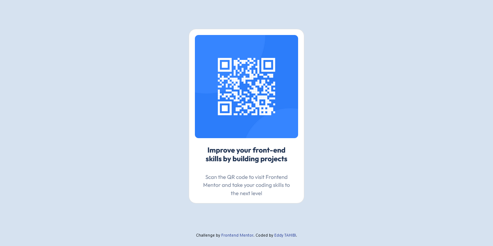

# Frontend Mentor - QR code component solution

This is a solution to the [QR code component challenge on Frontend Mentor](https://www.frontendmentor.io/challenges/qr-code-component-iux_sIO_H). Frontend Mentor challenges help you improve your coding skills by building realistic projects.

## Table of contents

- [Overview](#overview)
  - [Screenshot](#screenshot)
  - [Links](#links)
  - [Built with](#built-with)
- [Author](#author)

## Overview

### Screenshot

### Links

- Solution URL: https://www.frontendmentor.io/solutions/responsive-landing-page-using-boostrap-LtZNlq49qy
- Live Site URL: https://eddy-t.github.io/Frontend-Mentor-Challenge-QR-Code/

### Built with

- Semantic HTML5 markup
- CSS custom properties
- Boostrap
- Flexbox
- CSS Grid
- Mobile-first workflow

## Author

- Website - [Eddy TAHIBI](https://www.eddytahibi.fr)
- Frontend Mentor - [@eddy-t](https://www.frontendmentor.io/profile/eddy-t)
